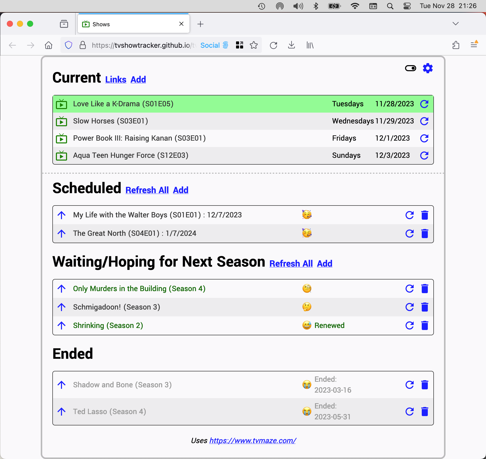
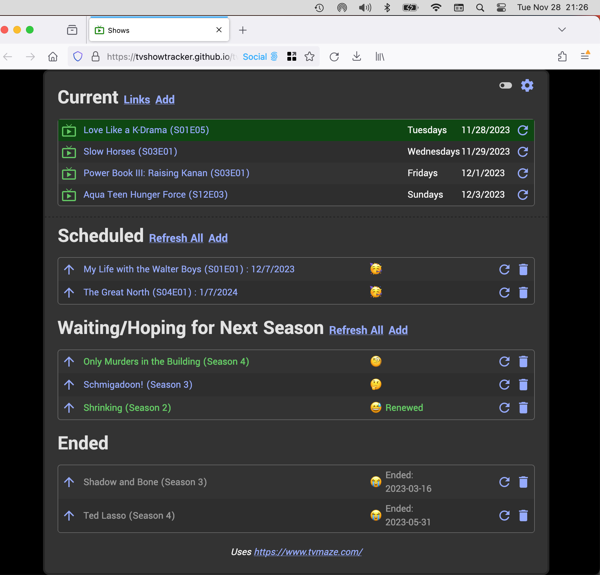

# TV Show Tracker

A simple TV Show Tracker that saves your data locally in your browser. This app uses the free api provided by https://www.tvmaze.com

The screenshots below feature a random selection of shows designed to highlight the various sections of the webapp.

Screenshot: Light mode

Screenshot: Dark mode

## Usage

You can either go to https://tvshowtracker.github.io/tv/ to use the TV Show Tracker, or you can download the project to your local machine and open the `index.html` file with your browser.

TV Show Tracker groups your shows into two areas - currently airing shows, and not currently airing shows. You can manually move shows between these two areas.

Within the not currently airing shows, there are three further areas - scheduled, waiting, and ended. TV Show Tracker will automatically place your not currently airing shows in the relevant area.

### Managing Shows

To add a show click any one of the "add" links. You will be presented with a search box, and once you have searched, you can click on the show you want to add.

Once added, you are left in the search box so you can search for and add more shows. When you are done adding shows, you can click cancel.

To move a show from one of the not currently airing areas to currently airing, click the up arrow. When a currently airing show has no more episodes, you will be able to click the down arrow to move it to the not currently airing shows area.

To get the latest details of a show, press the refresh button on the right of the show.

The show name is clickable, and the click action can be configured in settings. The default action is to show additional information about the show.

#### Currently Airing Shows

Click on "links" to show any links you have configured in settings.  

#### Not Currently Airing Shows

Shows that have a date for the next episode will appear in the "Scheduled" area.

Shows that are marked as ended will appear in the "Ended" area.

All other shows will appear in the "Waiting/Hoping for Next Season" area.

You can add your own notes about renewal by clicking the pen icon to the right of the emoji that appears when you hover over the show. If you include the phrase "renewed", the text will turn green. The text will also turn green if tvmaze indicates that there is a future season listed.

The renewal notes are clickable, and the click action can be configured in settings. The default action is to go the TVMaze page for the show. 

To delete a non-currently airing show, click the trashcan button on the right of the show.

### Settings

To toggle dark mode, click on the toggle in the top right to the left of the settings cog.

To configure your tracker, click on the settings cog.

Within settings you can:

* Choose whether to show emojis
* choose your preferred date format
* Choose where the show name links to
* Choose where the renewal notes links to
* Choose whether links open in a new window or not
* Choose whether to do a country check before showing links
* Enter any custom text to add to searches
* Add and delete links.

#### Date format

You may use any of the following characters to configure your date:

* Y = 4-digit year
* y = 2-digit year
* M = 2-digit month
* m = Month
* D = 2-digit day
* d = Day

#### Country Check

If you enable the country check, you can create a regular expression that will be matched against your current country code, determined from https://wtfismyip.com 

If the country code matches, the links will be displayed. If not, they will not appear.

An example regex that will show the links if you are in the US or the UK would be `(US)|(UK)`

#### Links

When you add a link, you can give it a name, a URL, and specify a regular expression based replacement to apply to the search. 

For example, if a search replaces spaces with dashes, you would put `\s` in the search box and `-` in the replace box.

Searches are automatically urlencoded.

#### Exporting and Importing Data

At the bottom of the settings area are buttons to export and import your TV data. This allows you to backup your shows and move or copy them to a different browser.

## TODO

Things that could do with some updating

* Better responsiveness for mobile
* Better alerts
* Better design overall
* Add auto refresh option

